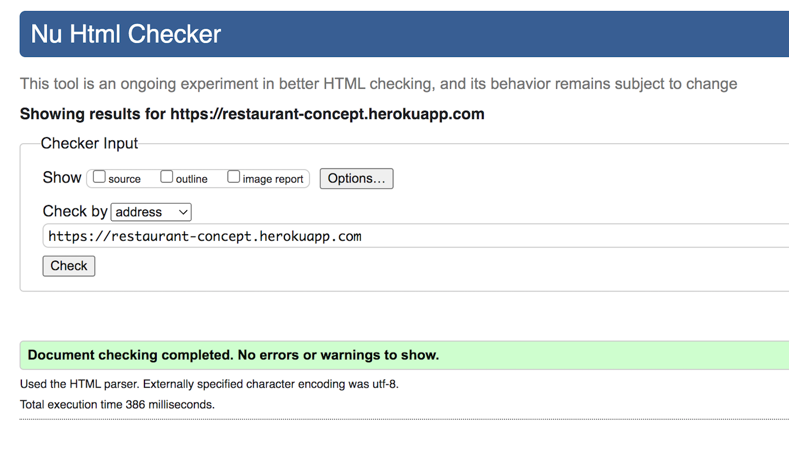
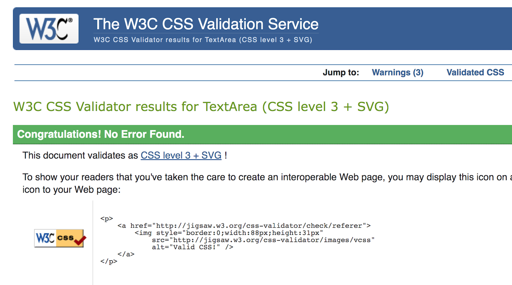
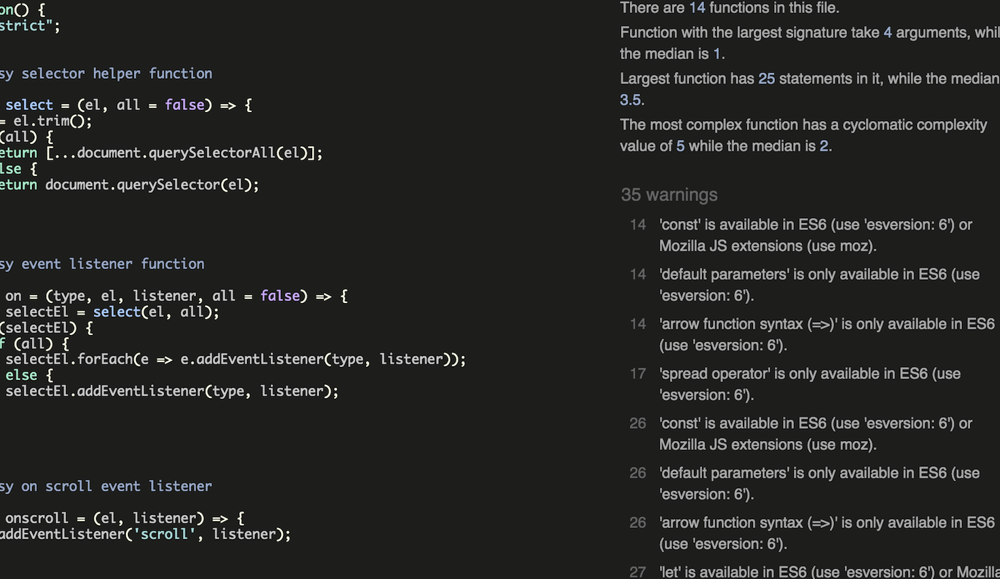
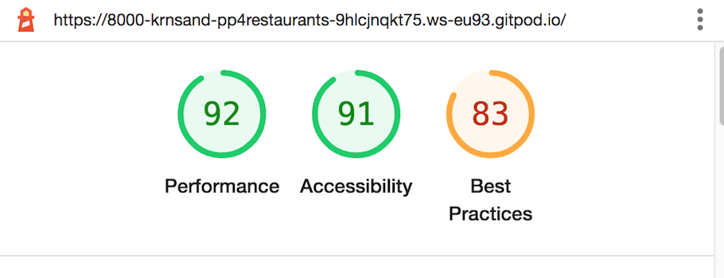

<!-- TOC -->

- [Validator Testing](#validator-testing)
    - [HTML](#html)
        - [Unclosed div](#unclosed-div)
    - [CSS](#css)
    - [Javascript](#javascript)
    - [Python](#python)
    - [Lighthouse](#lighthouse)
- [Browser Testing](#browser-testing)
- [Device Testing](#device-testing)
- [Manual Testing](#manual-testing)
- [Bugs](#bugs)

<!-- /TOC -->

## Validator Testing

### HTML

All HTML pages were run though the [nu-html-checker](https://validator.w3.org/). Most pages displayed zero errors, but some did, namely:

#### Open divs

After closing a couple open divs there were no errors in my HTML

### CSS

The only error I got was a missing s on a display-delay class, after fixing that there were no errors

### Javascript

I did not write the js myself, this I copied from the before mentioned template. With this said, there were no errors, just warnings. All missing semicolons were added but the warnings I left be

### Python

Editor suggestions for python formatting were used, using Black. A PEP8 max line-length of 79 characters was used throughout all Python files. All lasting errors are lines too long that I didn't manage to section off without breaking the code.

### Lighthouse

Lighthouse was used on all pages. Almost all pages returned around 90 scores on all categories, however, there were a few mentions in the console about error messages being shown in the console. WIll look into this till next project.:

## Browser Testing

The project was tested extensively on Google Chrome and Safari browsers, where no browser compatibility issues came up.

## Device Testing

The project was tested on a multitude of devices: several iPhones, android phones, linux laptops and Macbook Pro. The website was properly responsive on all devices.

## Manual Testing

I have tested every button manually to make sure they all work as intended. I have tested to redirect my browser to different view paths from when being logged off to see if I can access those pages without being logged in, without success. 
I have tested the responsiveness on multiple sites and they all look nice over teh different device sizes.

## Bugs

* I managed to mess up some part of deployment testing very close to deadline that made my deployed site not receive my static files, thus not looking very good completely unstyled. I was able to fix this together with tutor support.
* A still existing bug, is that I havn't been able to get the Placeholder text to show on some of the formfields in the reservation form. I'm going to look into that until the next project.
